<picture></picture>

<h1><i><b> MustardChef's Github Profile </b></i></h1> 
<h4><i> Programmer. Software and Hardware Enthusiast. </i></h4>

<a href="https://skillicons.dev">
 <picture></picture> 
</a>  

 
  <picture></picture>
  <picture></picture><picture></picture>

